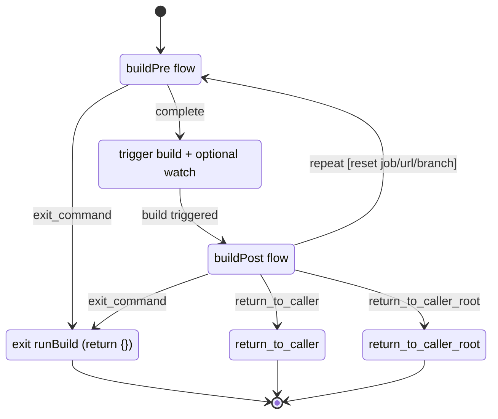
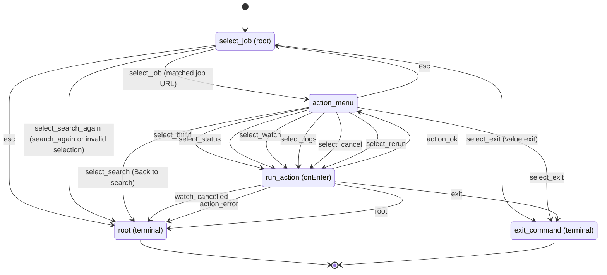
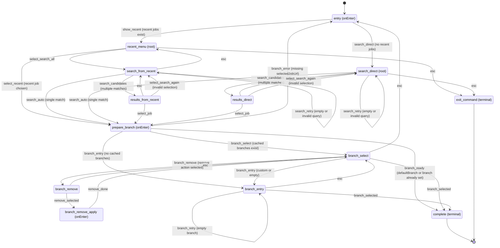
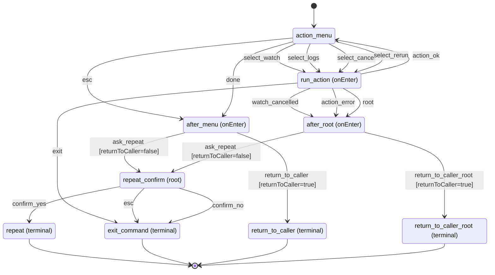
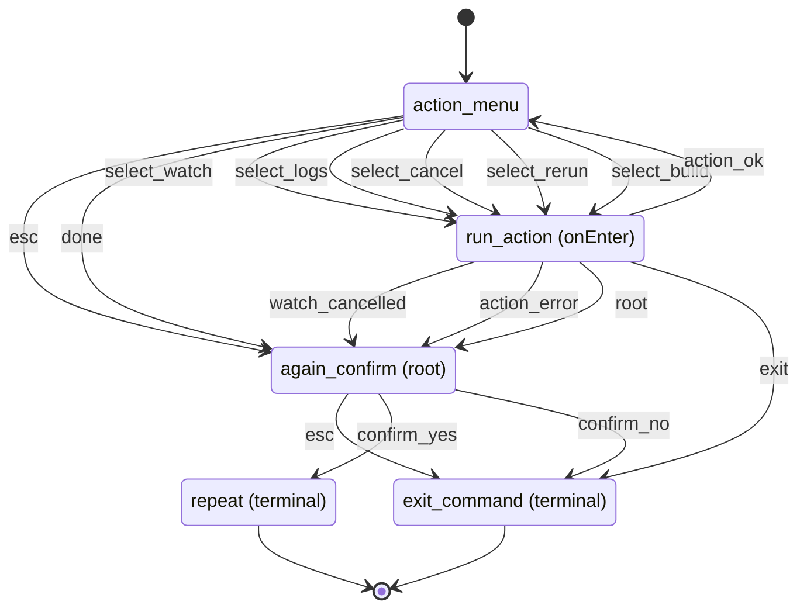

# TUI State Diagrams

These diagrams visualize interactive TUI transitions and the conditions that produce each event.

Source files:

- `src/flows/definition.ts`
- `src/flows/handlers.ts`
- `src/commands/build.ts`
- `src/commands/status.ts`
- `src/commands/list.ts`

Legend:

- Edge labels use `event [condition]`.
- `esc` means the prompt returned cancel (Escape/Ctrl+C in prompt UI).
- Nodes ending in `(terminal)` are flow terminal outcomes from `runFlow()`.
- Event labels use `_` instead of `:` because Mermaid state-diagram parsing rejects `:` in transition text.

## 1) Build Command Orchestration (High-Level)

## 2) `listInteractive` Flow

## 3) `buildPre` Flow

## 4) `buildPost` Flow

## 5) `statusPost` Flow

